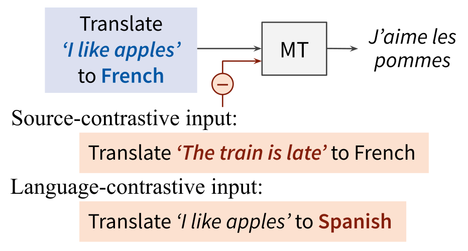

# Contrastive Decoding

[](#python)
[](https://opensource.org/licenses/MIT) 

<p align="center">
  
</p>

This repository is for my bachelor thesis. It contains all the code I used for reproducing the outputs for my evaluations as well as all the scrips I wrote in addition to process the obtained data. This README provides an overview of all the files and folder and how to use them.
This repository is forked and adapted from the original creator: source-contrastive and language-contrastive decoding, as described in [Sennrich et al. (EACL 2024)](https://arxiv.org/abs/2309.07098).

- In **source-contrastive decoding**, we search for a translation that maximizes P(_Y_|_X_) - λ·P(_Y_|_X'_), where _X'_ is a random source segment. This penalizes hallucinations.

- In **language-contrastive decoding**, we search for a translation that maximizes P(_Y_|_X_,_l_y_) - λ·P(_Y_|_X_,_l_y'_), where _l_y_ is the language indicator for the desired target language, _l_y'_ the indicator for some undesired language (such as English or the source language). This penalizes off-target translations.

<p align="center">

</p>

For my thesis I only used the **language-contrastive decoding** part of their implementation.


## Installation

!Note: The `transformers`library was upgraded from the original version `==4.33.1` to `==4.38.2` as there were some conflicts with my working environement.
- `pip install -r requirements.txt


## Structure of the Repsitory


## Code Adaptions from Original Repository
- **mt_task.py**: 1: Local access of source and reference data, instead of directly accessing the datasets via hugging face. 2: Adjusting the return variable of the `evaluate` function, including the dictionary with the probabilities for both Baseline and CD translation methods. 3: writing the translations and the probability dictionaries into output files.
- **translation_models/\_\_init\_\_.py**: rewriting an assert statement for the `translate` function, as I changed the format of the output to accomodate the probability dictionary.
- **translation_models/llama.py**: functions I adapted: `_translate`, `_translate_multi_source`, functions I added: `generate_step_by_step`--> calls the German/English prompted model to generate the next token based on the previous tokens produced during CD, `get_runner_ups`--> There are different variations of this code block through multiple functions to accomodate different input formats, but in general they all work similar to this when extracting the second and third most probable token at each generation step, including the normalized scores for probabilities over all possible tokens.

## Usage

**Example commands**
 
Baseline with [Llama 2 Chat (13B)](https://arxiv.org/abs/2307.09288) on English–German, using prompting with a one-shot example:
- `python -m scripts.run --model_path llama-2-13b-chat --language_pairs en-de  --oneshot`

Language-contrastive decoding with [Llama 2 Chat (13B)](https://arxiv.org/abs/2307.09288) on English–German, with λ_lang=0.5 and English as contrastive target language, using prompting with a one-shot example:
- `python -m scripts.run --model_path llama-2-13b-chat --language_pairs en-de --language_contrastive en  --language_weight -0.5 --oneshot`

Language-contrastive decoding with [Llama 2 Chat (13B)](https://arxiv.org/abs/2307.09288) on English–German, with λ_lang=0.9 and English as contrastive target language, using prompting with a one-shot example:
- `python -m scripts.run --model_path llama-2-13b-chat --language_pairs en-de --language_contrastive en  --language_weight -0.9 --oneshot`

In addition to the .txt files containing the translations, this repository also produces 3 json files, containing:
- A dictionary containing the top 3 most probable tokens at each generation step of the decoding.
- A dictionary containing the top 3 most probable German tokens given the previous generated CD tokens.
- A dictionary containing the top 3 most probable English tokens given the previous generated CD tokens.


## Dataset and Models:

This repository automatically opens and uses the pre-downloaded ```devtest``` sentences for English and German from the [FLORES-101](https://huggingface.co/datasets/gsarti/flores_101) dataset.
- ```de.txt```
- ```en.txt```

Multiple models are implemented:

- [Llama 2 7B Chat](https://huggingface.co/meta-llama). Use `--model_path llama-2-7b-chat` or `llama-2-13b-chat`


## Evaluation

ChrF2:
```
sacrebleu ref.txt < output.txt --metrics chrf
```


spBLEU:
```
sacrebleu ref.txt < output.txt --tokenize flores101
```


## Reference

```bibtex
@inproceedings{sennrich-etal-2024-mitigating,
      title={Mitigating Hallucinations and Off-target Machine Translation with Source-Contrastive and Language-Contrastive Decoding}, 
      author={Rico Sennrich and Jannis Vamvas and Alireza Mohammadshahi},
      booktitle={18th Conference of the European Chapter of the Association for Computational Linguistics},
      year={2024}
}
```
